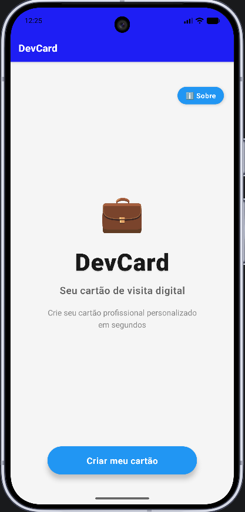
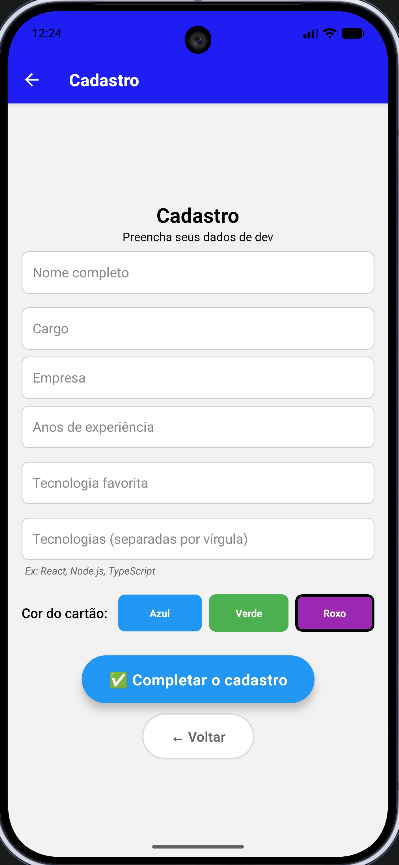
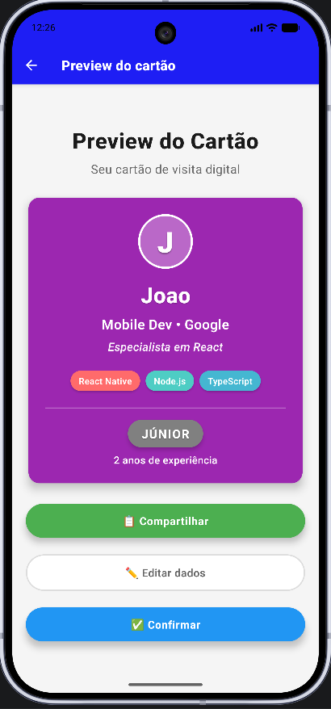
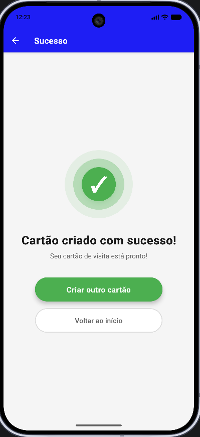
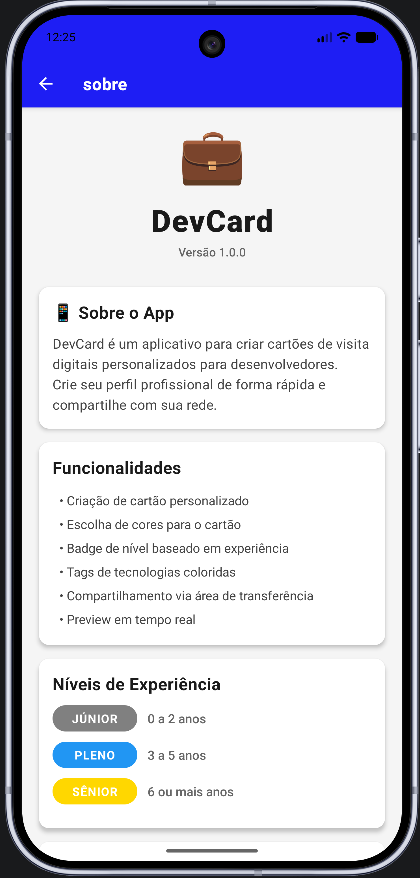

# DevCard - Cartão de Visita Digital

Versão: 1.0.0

DevCard é um aplicativo mobile para criar cartões de visita digitais personalizados para desenvolvedores. Crie seu perfil profissional de forma rápida, visualize em tempo real e compartilhe com sua rede.

## Sumário

- [Sobre o App](#sobre-o-app)
- [Funcionalidades](#funcionalidades)
- [Telas do Aplicativo](#telas-do-aplicativo)
  - [1. Tela Inicial](#1-tela-inicial-indextsx)
  - [2. Tela de Cadastro](#2-tela-de-cadastro-cadastrotsx)
  - [3. Tela de Preview](#3-tela-de-preview-previewtsx)
  - [4. Tela de Sucesso](#4-tela-de-sucesso-sucessotsx)
  - [5. Tela Sobre](#5-tela-sobre-sobretsx)
- [Níveis de Experiência](#níveis-de-experiência)
- [Tecnologias Utilizadas](#tecnologias-utilizadas)
- [Instalação](#instalação)
- [Como Usar](#como-usar)
- [Estrutura de Navegação](#estrutura-de-navegação)
- [Paleta de Cores](#paleta-de-cores)
- [Funcionalidades Detalhadas](#funcionalidades-detalhadas)
- [Desenvolvido por](#desenvolvido-por)

## Sobre o App

O DevCard permite que desenvolvedores criem cartões de visita digitais profissionais com informações personalizadas, incluindo nome, cargo, empresa, anos de experiência, tecnologias favoritas e muito mais. O aplicativo oferece uma interface intuitiva e moderna com preview em tempo real.

## Funcionalidades

- Criação de cartão personalizado - Preencha seus dados profissionais
- Escolha de cores para o cartão - Azul, Verde ou Roxo
- Badge de nível baseado em anos de experiência - Júnior, Pleno ou Sênior
- Tags de tecnologias coloridas - Adicione múltiplas tecnologias como chips visuais
- Compartilhamento via área de transferência - Copie seus dados formatados
- Preview em tempo real - Visualize seu cartão antes de confirmar
- Página sobre o app - Informações completas sobre funcionalidades
- Tela de sucesso animada - Feedback visual ao criar o cartão

## Telas do Aplicativo

### 1. Tela Inicial (index.tsx)


**Descrição**: Tela de boas-vindas do aplicativo.

**Funcionalidades**:
- Apresentação do app com título estilizado
- Botão principal "Criar meu cartão" para iniciar o cadastro
- Botão "Sobre" no canto superior direito para acessar informações do app
- Design clean com fundo suave e tipografia moderna

**Elementos visuais**:
- Ícone de maleta em destaque
- Título "DevCard" com sombra e espaçamento de letras
- Subtítulo descritivo
- Botão arredondado azul com sombra

---

### 2. Tela de Cadastro (cadastro.tsx)



**Descrição**: Formulário completo para criação do cartão de visita.

**Funcionalidades**:

**Campos de entrada**:
- Nome completo (obrigatório, mínimo 3 caracteres)
- Cargo (obrigatório)
- Empresa (opcional)
- Anos de experiência (obrigatório, numérico)
- Tecnologia favorita (obrigatório)
- Tecnologias (obrigatório, separadas por vírgula)

**Seleção de cor do cartão**: Azul, Verde ou Roxo

**Validação em tempo real**: Mensagens de erro para campos inválidos

**Texto de ajuda**: Exemplo de como preencher tecnologias

**Botões de ação**:
- "Completar o cadastro" - Valida e avança para preview
- "Voltar" - Retorna à tela inicial

**Validações**:
- Nome: obrigatório e mínimo 3 caracteres
- Cargo: obrigatório
- Anos de experiência: número válido e não negativo
- Tecnologia favorita: obrigatório
- Tecnologias: pelo menos uma tecnologia

---

### 3. Tela de Preview (preview.tsx)



**Descrição**: Visualização do cartão de visita criado com todas as informações.

**Funcionalidades**:

**Avatar circular**: Primeira letra do nome em destaque

**Informações exibidas**:
- Nome em fonte grande e bold
- Cargo e empresa (separados por ponto)
- "Especialista em [tecnologia favorita]"
- Chips coloridos com todas as tecnologias
- Badge de nível (Júnior/Pleno/Sênior) com cor específica
- Anos de experiência

**Botões de ação**:
- "Compartilhar" - Copia dados formatados para área de transferência
- "Editar dados" - Volta para o cadastro
- "Confirmar" - Finaliza e vai para tela de sucesso

**Design do cartão**:
- Cor de fundo personalizada (escolhida no cadastro)
- Avatar com borda branca e fundo semi-transparente
- Texto branco com sombras para legibilidade
- Chips de tecnologia com 8 cores diferentes
- Badge com sombra e cores específicas por nível
- Divisor visual entre seções

**Funcionalidade de compartilhamento**:
- Formata os dados como texto estruturado
- Inclui ícones para melhor visualização
- Copia para clipboard com feedback visual (Alert)

---

### 4. Tela de Sucesso (sucesso.tsx)



**Descrição**: Confirmação visual de que o cartão foi criado com sucesso.

**Funcionalidades**:

**Ícone de sucesso animado**: Três círculos concêntricos com checkmark
- Círculo externo: Verde claro (opacidade 0.1)
- Círculo médio: Verde médio (opacidade 0.3)
- Círculo interno: Verde sólido com sombra
- Checkmark branco centralizado

**Mensagens**:
- Título: "Cartão criado com sucesso!"
- Subtítulo: "Seu cartão de visita está pronto!"

**Botões de ação**:
- "Criar outro cartão" - Verde, destaque principal
- "Voltar ao início" - Branco com borda, secundário

**Design**:
- Fundo suave
- Ícone com efeito de profundidade
- Contraste claro entre botões primário e secundário
- Tipografia moderna com espaçamento de letras

---

### 5. Tela Sobre (sobre.tsx)



**Descrição**: Informações completas sobre o aplicativo.

**Funcionalidades**:

**Seções informativas**:
- Sobre o App: Descrição e propósito
- Funcionalidades: Lista completa de recursos
- Níveis de Experiência: Badges com cores e faixas de anos
- Desenvolvido por: Créditos do projeto
- Tecnologias Utilizadas: Stack tecnológico

**Design em cards**: Cada seção em card branco com sombra

**Scrollable**: Conteúdo rolável para acomodar todas as informações

**Botão de retorno**: "Voltar" para voltar à tela anterior

**Informações de níveis**:
- Júnior (Cinza): 0 a 2 anos
- Pleno (Azul): 3 a 5 anos
- Sênior (Dourado): 6 ou mais anos

---

## Níveis de Experiência

O aplicativo classifica automaticamente o desenvolvedor em três níveis baseado nos anos de experiência:

| Nível | Anos de Experiência | Cor da Badge |
|-------|---------------------|--------------|
| Júnior | 0 a 2 anos | Cinza (#808080) |
| Pleno | 3 a 5 anos | Azul (#2196F3) |
| Sênior | 6 ou mais anos | Dourado (#FFD700) |

## Tecnologias Utilizadas

- React Native - Framework para desenvolvimento mobile
- Expo - Plataforma para desenvolvimento React Native
- TypeScript - Superset JavaScript com tipagem estática
- Expo Router - Sistema de navegação baseado em arquivos
- Expo Clipboard - API para copiar texto para área de transferência

## Instalação

### Pré-requisitos

- Node.js (versão 14 ou superior)
- npm ou yarn
- Expo CLI (opcional, mas recomendado)

### Passos

1. Clone o repositório:
```bash
git clone <url-do-repositorio>
cd projeto-devcard
```

2. Instale as dependências:
```bash
npx expo install
```

3. Inicie o projeto:
```bash
npx expo start -c
```

4. Execute no dispositivo:
- Escaneie o QR code com o app Expo Go (Android/iOS)
- Ou pressione `a` para Android emulator
- Ou pressione `i` para iOS simulator

## Como Usar

1. Inicie o app e toque em "Criar meu cartão"
2. Preencha seus dados:
   - Nome completo
   - Cargo atual
   - Empresa (opcional)
   - Anos de experiência
   - Tecnologia favorita
   - Lista de tecnologias (separadas por vírgula)
3. Escolha a cor do seu cartão (Azul, Verde ou Roxo)
4. Visualize o preview do seu cartão
5. Compartilhe copiando os dados para área de transferência
6. Confirme para finalizar

## Estrutura de Navegação

```
/                    → Tela inicial
/cadastro           → Formulário de cadastro
/preview            → Preview do cartão
/sucesso            → Confirmação de sucesso
/sobre              → Informações do app
```

## Paleta de Cores

### Cores Principais
- Azul: #2196F3 (Botões primários, cor de cartão)
- Verde: #4CAF50 (Sucesso, compartilhar, cor de cartão)
- Roxo: #9C27B0 (Cor de cartão)

### Cores de Nível
- Cinza: #808080 (Júnior)
- Azul: #2196F3 (Pleno)
- Dourado: #FFD700 (Sênior)

### Cores de Tecnologia (Chips)
- #FF6B6B, #4ECDC4, #45B7D1, #FFA07A
- #98D8C8, #F7DC6F, #BB8FCE, #85C1E2

## Funcionalidades Detalhadas

### Validação de Formulário
- Validação em tempo real
- Mensagens de erro específicas
- Campos obrigatórios destacados
- Feedback visual imediato

### Sistema de Badges
- Cálculo automático baseado em experiência
- Cores distintas para cada nível
- Texto em uppercase com espaçamento de letras
- Sombras para profundidade

### Chips de Tecnologia
- Parsing de string separada por vírgulas
- Cores rotativas de uma paleta de 8 cores
- Design arredondado com sombras
- Flexbox wrap para múltiplas linhas

### Compartilhamento
- Formatação de texto estruturada
- Ícones para melhor visualização
- Cópia para clipboard
- Feedback com Alert nativo

## Desenvolvido por 

### João Vitor Cordeiro Juliano - 4510306525

Projeto desenvolvido como atividade prática de desenvolvimento mobile com React Native e Expo.
